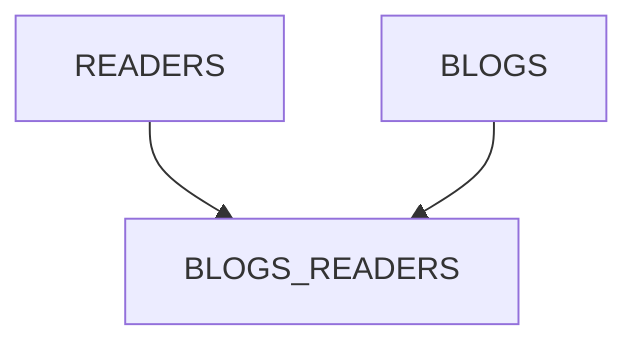

# Test Bandesal
### Dada la siguiente estructura de base de datos que permite almacenar lectores, blogs y lectores por blog; crear una aplicación que permita registrar los lectores, los blogs y los lectores que visitan cada blog.

1. Deberá crear las tablas en el esquema de base de datos seleccionada.
2. Elaborar pantalla de inicio de sesión de usuario. La contraseña almacenada
debe estar cifrada.
Nota: Se solicitará en la demostración agregar un nuevo usuario y
autenticarse con este.
3. Crear la plantilla de la interfaz de usuario de acuerdo con el modelo propuesto
en la figura 2.
4. Para registrar y modificar los lectores por blog deberá hacer uso de listas de
valores.
5. Los ID de los readers y blogs deberán llenarse automáticamente mediante
una secuencia desde la aplicación.
6. Cree el mantenimiento de las tablas readers, blogs y blogs_readers. Para
cada tabla se deberá poder consultar, editar, crear y eliminar sus registros.
Utilice la plantilla antes creada con su respectivo menú.
7. Implemente todas las validaciones que sean necesarias para asegurar la
integridad de los datos y trate de realizar el mejor manejo de errores
posible.
8. Publique la aplicación en el servidor de aplicaciones que desee y cree el
origen de datos necesario para el correcto funcionamiento de la aplicación.


## Consideraciones:
• Puede usar la base de datos de su preferencia.

• Puede usar el servidor de aplicaciones que desee.

• Debe usar Prime Faces para la vista, EJBs y JPA para el manejo de la
persistencia.

## Mapa de entidad relación 



|READERS |  | 
| ------------- | ------------- | 
| Id | `Serial `| 
| Name | `Varchar  `| 

|BLOGS_READERS|  | 
| ------------- | ------------- | 
| Id | `Serial` | 
| ReaderId| `Integer`| 
| BlogId| `Integer`| 


|BLOGS|  | 
| ------------- | ------------- | 
| Id | `Serial `| 
| Title| `Varchar`| 
| Description| `Varchar`| 

# Figura 2


# test_bandesal_api

This project uses Quarkus, the Supersonic Subatomic Java Framework.

If you want to learn more about Quarkus, please visit its website: https://quarkus.io/ .

## Running the application in dev mode

You can run your application in dev mode that enables live coding using:

```shell script
./mvnw compile quarkus:dev
```

> **_NOTE:_**  Quarkus now ships with a Dev UI, which is available in dev mode only at http://localhost:8080/q/dev/.

## Packaging and running the application

The application can be packaged using:

```shell script
./mvnw package
```

It produces the `quarkus-run.jar` file in the `target/quarkus-app/` directory.
Be aware that it’s not an _über-jar_ as the dependencies are copied into the `target/quarkus-app/lib/` directory.

The application is now runnable using `java -jar target/quarkus-app/quarkus-run.jar`.

If you want to build an _über-jar_, execute the following command:

```shell script
./mvnw package -Dquarkus.package.type=uber-jar
```

The application, packaged as an _über-jar_, is now runnable using `java -jar target/*-runner.jar`.

## Creating a native executable

You can create a native executable using:

```shell script
./mvnw package -Dnative
```

Or, if you don't have GraalVM installed, you can run the native executable build in a container using:

```shell script
./mvnw package -Dnative -Dquarkus.native.container-build=true
```

You can then execute your native executable with: `./target/test_bandesal_api-1.0-SNAPSHOT-runner`

If you want to learn more about building native executables, please consult https://quarkus.io/guides/maven-tooling.

## Related Guides

- RESTEasy Classic JSON-B ([guide](https://quarkus.io/guides/rest-json)): JSON-B serialization support for RESTEasy
  Classic

## Provided Code

### RESTEasy JAX-RS

Easily start your RESTful Web Services

[Related guide section...](https://quarkus.io/guides/getting-started#the-jax-rs-resources)

### RESTEasy Reactive

Easily start your Reactive RESTful Web Services

[Related guide section...](https://quarkus.io/guides/getting-started-reactive#reactive-jax-rs-resources)
